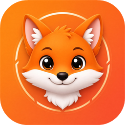

<p align="center">
  
</p>

# ffshot

タスクトレイに常駐し、ホットキーで PNG スクリーンショットを保存する Windows アプリです。

- 全画面 / アクティブウィンドウをそれぞれ別のホットキーで撮影
- 取得方式を「通常 (GDI)」と「DirectX (Direct3D / DXGI Desktop Duplication)」から選択
  - GDI で真っ黒になる DirectX 全画面（ボーダーレス）アプリは Direct3D 方式で撮影できます
  - Direct3D 方式が使えない環境（リモートデスクトップ等）では自動的に GDI にフォールバックします
- 設定は `%APPDATA%\ffshot\settings.json` に保存

## 動作環境

- Windows 10 1809 以降 / Windows 11
- .NET 10 ランタイム（ビルドには .NET 10 SDK）

## ビルド・実行

```powershell
dotnet build ffshot.sln
dotnet run --project src/FFShot
dotnet test ffshot.sln
```

配布用に単一 exe（.NET ランタイム同梱、約 55 MB）を作る場合:

```powershell
dotnet publish src/FFShot -c Release -r win-x64 -o publish
```

## ダウンロード

[Releases](https://github.com/uehatsu/ffshot/releases) から `ffshot-<version>-win-x64.zip` を取得し、展開した `ffshot.exe` を実行してください。ランタイムのインストールは不要です。コード署名をしていないため、初回起動時に SmartScreen の警告が出る場合があります。「詳細情報」→「実行」で起動できます。

### CI / リリース

- push / PR ごとに GitHub Actions（`ci.yml`）がビルド・テスト・publish を行い、exe を Actions の成果物として添付します。
- `v1.2.3` のようなタグを push すると `release.yml` が zip と SHA256 を GitHub Release に添付します。

```powershell
git tag v0.1.0
git push origin v0.1.0
```

画面を実際に撮るテスト（`Category=Screen`）はランナーの仮想ディスプレイでは動かないため CI では除外しています。ローカルでは `dotnet test` で全件実行されます。

WSL から Windows 側の SDK を使う場合は `"/mnt/c/Program Files/dotnet/dotnet.exe"` を呼びます。

## 使い方

起動するとトレイにカメラアイコンが出ます。ダブルクリックまたは右クリック → 「設定...」で以下を変更できます。

| 項目 | 既定値 |
|---|---|
| 全画面のホットキー | `Ctrl+Shift+F12` |
| アクティブウィンドウのホットキー | `Ctrl+Shift+F11` |
| 取得方式 | 通常 (GDI) |
| 保存先フォルダ | `%USERPROFILE%\Pictures\ffshot` |
| ファイル名パターン | `ffshot_{yyyyMMdd_HHmmss}` |
| 全画面撮影で全モニターを結合する | オフ（アクティブウィンドウのあるモニターのみ） |
| マウスカーソルを含める | オフ |
| 保存時に通知を表示する | オン |
| Windows ログオン時に自動起動する | オフ |

ファイル名パターンの `{ }` 内には .NET の日時書式を書けます。`{target}` は `full` / `window` に展開されます。同名ファイルがある場合は `_1`, `_2` … が付きます。

ホットキーの入力欄では、押したキーの組み合わせがそのまま設定されます。Backspace で解除できます。他アプリと競合して登録できなかった場合はトレイ通知でお知らせします。

## 管理者権限で動くアプリ（ゲームなど）を撮る

Windows の UIPI により、通常権限のアプリが登録したホットキーは、管理者権限のウィンドウが前面にあるときは届きません。PlayOnline Viewer のように `requireAdministrator` で起動するアプリを撮る場合は、トレイメニューの「管理者として再起動」を使ってください（UAC の確認が 1 回出ます）。

自動起動の登録先は権限に応じて切り替わります。

| ffshot の権限 | 登録先 | ログオン時の起動 |
|---|---|---|
| 通常権限 | `HKCU\...\Run` | 通常権限 |
| 管理者 | タスクスケジューラ（タスク名 `ffshot`、最上位の特権） | 管理者権限、UAC なし |

管理者権限で常駐させたい場合は、「管理者として再起動」してから設定の「Windows ログオン時に自動起動する」をオンにしてください。

## 構成

```
src/FFShot/
  App/        TrayApplicationContext（トレイ・配線）, CaptureService, Elevation,
              StartupManager（Run キー / タスクスケジューラの振り分け）
  Hotkeys/    HotkeyBinding（文字列変換）, HotkeyManager（RegisterHotKey）
  Capture/    ICaptureBackend, GdiCaptureBackend, DesktopDuplicationBackend, WindowInfo, CursorOverlay
  Output/     FileNamer, PngWriter
  Settings/   AppSettings, SettingsStore
  UI/         SettingsForm, HotkeyTextBox
tests/FFShot.Tests/   xunit（画面を実際に撮るテストを含むため Windows 上で実行）
```

## 既知の制限

- Direct3D 方式は HDR 有効時（R16G16B16A16_FLOAT）や回転したディスプレイに未対応です。その場合は GDI にフォールバックします。
- 隠れているウィンドウの中身は撮れません（画面に見えている内容を切り出します）。
